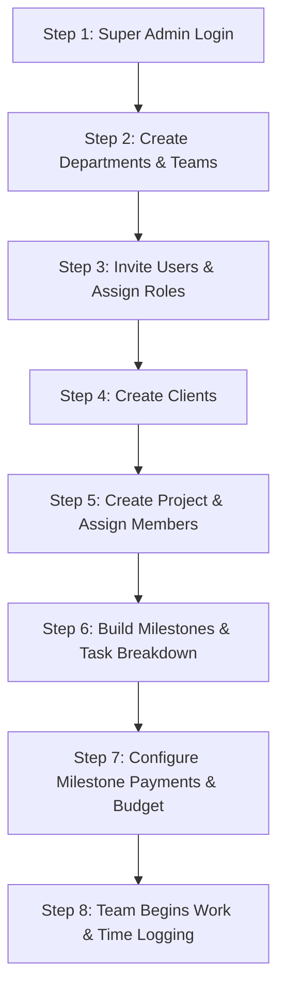
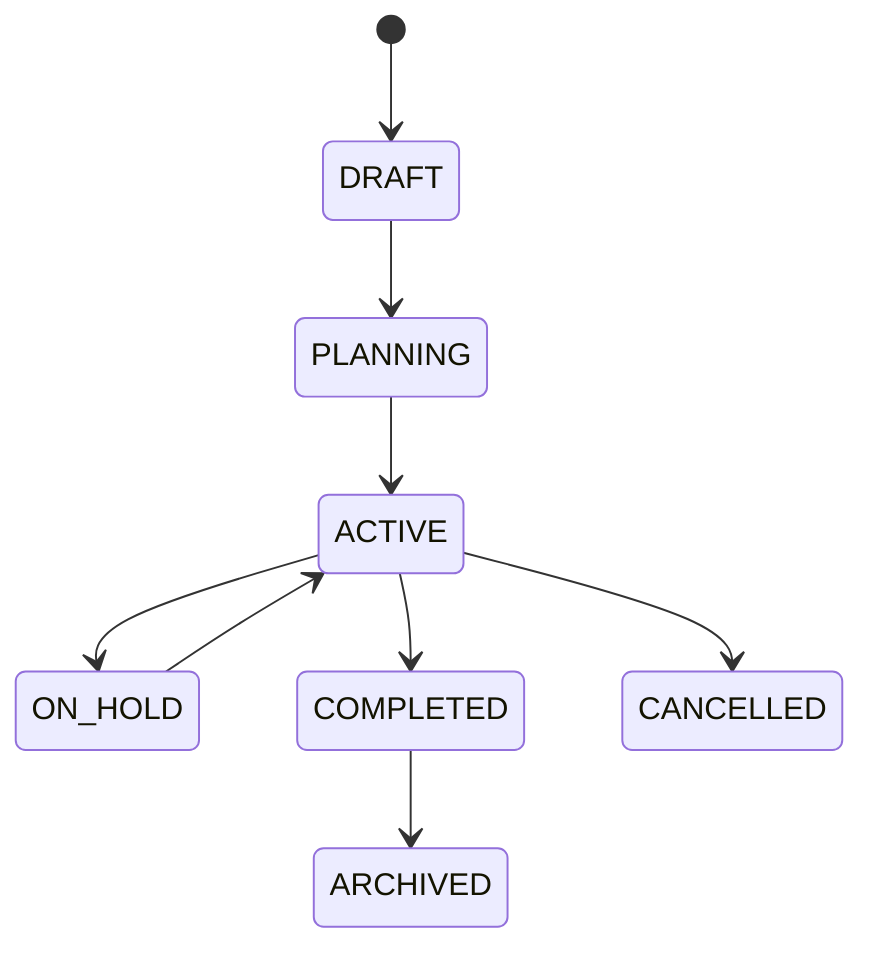
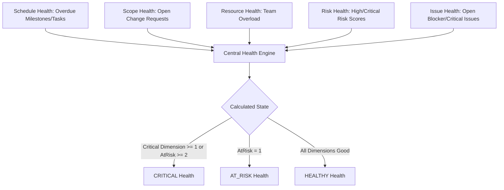

# Project Management Portal (PMP) — Official User Guide

Welcome to the **Project Management Portal (PMP)** User Guide. This comprehensive handbook provides step-by-step instructions for managing modern software and enterprise engineering projects from initiation to delivery, governance, and financial settlement.

---

## Table of Contents

1. [Chapter 1: Introduction & System Overview](#chapter-1-introduction--system-overview)
2. [Chapter 2: Quick Start Onboarding Guide](#chapter-2-quick-start-onboarding-guide)
3. [Chapter 3: Super Administrator Guide](#chapter-3-super-administrator-guide)
4. [Chapter 4: Project Administrator (Admin) Guide](#chapter-4-project-administrator-admin-guide)
5. [Chapter 5: Team Member (User) Guide](#chapter-5-team-member-user-guide)
6. [Chapter 6: Client Management](#chapter-6-client-management)
7. [Chapter 7: Project Lifecycle & Setup](#chapter-7-project-lifecycle--setup)
8. [Chapter 8: Milestones Management](#chapter-8-milestones-management)
9. [Chapter 9: Task & Backlog Management](#chapter-9-task--backlog-management)
10. [Chapter 10: Subtasks & Dependency Chains](#chapter-10-subtasks--dependency-chains)
11. [Chapter 11: Daily User Workflow (8-Step Routine)](#chapter-11-daily-user-workflow-8-step-routine)
12. [Chapter 12: Collaboration: Comments, Mentions & Documents](#chapter-12-collaboration-comments-mentions--documents)
13. [Chapter 13: Time Tracking, Work Logs & Timesheets](#chapter-13-time-tracking-work-logs--timesheets)
14. [Chapter 14: Schedule Planning: Calendar & Timeline Views](#chapter-14-schedule-planning-calendar--timeline-views)
15. [Chapter 15: Workload, Capacity & Utilization](#chapter-15-workload-capacity--utilization)
16. [Chapter 16: Project Progress Calculations](#chapter-16-project-progress-calculations)
17. [Chapter 17: Project Risk Register & Matrix](#chapter-17-project-risk-register--matrix)
18. [Chapter 18: Project Issue Tracking & Resolutions](#chapter-18-project-issue-tracking--resolutions)
19. [Chapter 19: Automated Project Health & Overrides](#chapter-19-automated-project-health--overrides)
20. [Chapter 20: Change Request Management (Scope & Budget)](#chapter-20-change-request-management-scope--budget)
21. [Chapter 21: Approval Workflows & Governance](#chapter-21-approval-workflows--governance)
22. [Chapter 22: Project & Task Templates](#chapter-22-project--task-templates)
23. [Chapter 23: Recurring Tasks Engine](#chapter-23-recurring-tasks-engine)
24. [Chapter 24: Project Baselines & Variance Analysis](#chapter-24-project-baselines--variance-analysis)
25. [Chapter 25: Project Closure, Archive & Restore](#chapter-25-project-closure-archive--restore)
26. [Chapter 26: Financial Management (Super Admin Only)](#chapter-26-financial-management-super-admin-only)
27. [Chapter 27: Role-Specific Dashboards](#chapter-27-role-specific-dashboards)
28. [Chapter 28: Critical Business Rules & Invariants](#chapter-28-critical-business-rules--invariants)
29. [Chapter 29: Complete End-to-End Walkthrough Scenario](#chapter-29-complete-end-to-end-walkthrough-scenario)

---

## Chapter 1: Introduction & System Overview

### What is PMP?
The **Project Management Portal (PMP)** is an enterprise-grade multi-tenant platform designed to coordinate project teams, track deliverables and milestone progress, automate time logging and approval flows, manage commercial engagements and milestone payments, and provide comprehensive governance across risks, issues, and change requests.

### Who Uses PMP?
- **Executives & Directors (Super Admin)**: Maintain complete visibility over organizational accounts, system roles, client relationships, corporate health, invoices, and payment collections.
- **Project Managers & Leads (Admin)**: Create and direct projects, configure milestone roadmaps, delegate tasks, approve timesheets, manage change requests, and mitigate risks.
- **Engineers & Designers (User)**: Work on assigned tasks, log daily time, submit weekly timesheets, communicate via comments and mentions, upload deliverables, and raise issues or change requests.

### System Roles & Permission Matrix

| Capability / Module | Super Admin | Project Admin | Team Member (User) |
| :--- | :---: | :---: | :---: |
| **Manage System Users & Status** | ✅ Full Access | ❌ | ❌ |
| **Manage Roles & Permissions** | ✅ Full Access | ❌ | ❌ |
| **Create Departments & Teams** | ✅ Full Access | ✅ Read Only | ✅ Read Only |
| **Manage Clients** | ✅ Full Access | ✅ Full Access | ❌ |
| **Create & Configure Projects** | ✅ Full Access | ✅ Full Access | ❌ |
| **View Projects** | ✅ All Projects | ✅ All Projects | 🔒 Assigned Projects Only |
| **Create Milestones & Tasks** | ✅ Full Access | ✅ Full Access | ❌ |
| **Update Task Status & Progress** | ✅ Full Access | ✅ Full Access | ✅ Assigned Tasks |
| **Log Work Time (Work Logs)** | ✅ Full Access | ✅ Full Access | ✅ Assigned Tasks |
| **Submit Weekly Timesheets** | ✅ Full Access | ✅ Full Access | ✅ Own Timesheets |
| **Approve / Reject Timesheets** | ✅ Full Access | ✅ Full Access | ❌ |
| **Manage Risks & Issues** | ✅ Full Access | ✅ Full Access | ✅ Create & View Assigned |
| **Submit Change Requests** | ✅ Full Access | ✅ Full Access | ✅ Create Draft & Submit |
| **Approve Change Requests** | ✅ Full Access | ✅ Authorized Steps | ❌ |
| **Create & Instantiate Templates** | ✅ Full Access | ✅ Full Access | ✅ Read Only |
| **Create Baselines** | ✅ Full Access | ✅ Full Access | ✅ Read Only |
| **Archive & Restore Projects** | ✅ Full Access | ✅ Project Owner/Admin | ❌ |
| **Financial Settings & Contract Values** | 🔐 **Strict Super Admin Only** | ⛔ **403 Forbidden** | ⛔ **403 Forbidden** |
| **Invoices & Payment Transactions** | 🔐 **Strict Super Admin Only** | ⛔ **403 Forbidden** | ⛔ **403 Forbidden** |

---

## Chapter 2: Quick Start Onboarding Guide

When launching PMP for a new organization, execute setup in the following sequence:



1. **Log in as Super Admin** using initial credentials (`admin@pmp.local`).
2. **Setup Departments** (e.g., *Engineering*, *Product Design*, *Quality Assurance*).
3. **Invite Users** via **Users → New User**, assigning appropriate roles (`ADMIN` or `USER`).
4. **Create Clients** via **Clients → New Client** with billing details and primary points of contact.
5. **Create Projects** linking the client, start/target dates, project owner, and member roster.
6. **Define Milestones & Tasks** under the project workspace.
7. **Configure Financials (Super Admin Only)** setting contract value, payment tranches, and milestone budgets.
8. **Commence Execution**: Team members review **My Work**, log work, and report project progress.

---

## Chapter 3: Super Administrator Guide

The **Super Admin** holds unrestricted wildcard access (`*`) across all organizational settings, infrastructure, user management, and commercial modules.

```
[SCREENSHOT: Super Admin Dashboard Overview with Global Metric Cards]
```

### Key Responsibilities
- **User Lifecycle Governance**:
  - Navigate to **Users** to create, view, update profiles, or modify lifecycle status (`ACTIVE`, `INACTIVE`, `SUSPENDED`, `ARCHIVED`).
  - Assign system roles (`SUPER_ADMIN`, `ADMIN`, `USER`).
- **Organization Hierarchy**:
  - Manage **Departments** and **Teams** with designated Team Leads.
- **Enterprise Financial Oversight**:
  - Access **Finance → Dashboard** to inspect total contract revenue, total invoiced, payments collected, outstanding accounts receivable, and overdue amounts.
  - Issue milestone invoices and record wire/bank payments.
- **System Activity & Audit Stream**:
  - Review live security and audit records under **System Activity**.

> [!IMPORTANT]
> Super Admin credentials should be protected with strong authentication. Deactivating an administrator immediately blocks their active sessions.

---

## Chapter 4: Project Administrator (Admin) Guide

Project Administrators oversee operational execution, resource planning, deliverable review, and team coordination.

```
[SCREENSHOT: Project Detail View - Management Tabs & Summary Metrics]
```

### What Project Admins Can Do
- **Project Initiation & Teaming**: Create projects, assign project managers, and add team members.
- **Milestone & Work Breakdown**: Create project milestones, primary tasks, and assign task dependencies.
- **Time Approval**: Review, approve, or reject weekly timesheet submissions under **Timesheets**.
- **Project Governance**: Create risks, log issues, evaluate change requests, and override project health when warranted.
- **Baselines & Closure**: Capture project baseline snapshots and perform pre-closure validation before archiving completed projects.

### What Project Admins CANNOT Do
- **Zero Financial Access**: Project Admins are strictly barred from `/finance`, invoice generation, contract value editing, and payment logging. Any direct API attempt yields `403 Forbidden`.

---

## Chapter 5: Team Member (User) Guide

Team Members focus on executing deliverables, tracking time, collaborating on tasks, and raising alerts.

```
[SCREENSHOT: My Work Dashboard View with Today's Priority Tasks]
```

### Daily User Journey
1. **Access My Work**: Open **My Work** from the sidebar to view all assigned tasks organized by priority and due dates.
2. **Inspect Task Details**: Click a task to view description, acceptance criteria, attached documents, and comments.
3. **Update Status**: Transition tasks across `TODO` → `IN_PROGRESS` → `IN_REVIEW` → `COMPLETED`.
4. **Collaborate**: Post updates, mention teammates using `@Name`, and attach review files.
5. **Log Daily Hours**: Log hours worked directly against the task.
6. **Submit Timesheets**: At week-end, open **My Timesheets**, review logged hours, and submit for manager approval.

---

## Chapter 6: Client Management

Clients represent customer organizations or external partners sponsoring projects.

```
[SCREENSHOT: Client Directory & Create Client Form]
```

### Managing Clients
1. Navigate to **Clients**.
2. Click **+ New Client**.
3. Provide:
   - **Client Name**: Organization name (e.g., *Acme Enterprise Inc.*).
   - **Email & Phone**: Primary billing / POC contact details.
   - **Website & Address**: Official corporate address used for invoice generation.
4. **Client Projects View**: Click any client card to inspect active and completed project engagements associated with the account.

---

## Chapter 7: Project Lifecycle & Setup

Each project progresses through defined lifecycle stages:



### Project Setup Steps
1. Navigate to **Projects** and click **+ New Project**.
2. Fill required fields:
   - **Project Code**: Unique project identifier (e.g., `PRJ-001`).
   - **Project Name**: Clear descriptive title.
   - **Client**: Associate the client account.
   - **Owner / Manager**: Designate lead administrator.
   - **Start & Target Dates**: Calendar delivery window.
3. **Assign Members**: Under project settings, click **Add Member** to select team members and project roles (`MANAGER`, `MEMBER`, `VIEWER`).

---

## Chapter 8: Milestones Management

Milestones represent major delivery checkpoints or commercial payment gates.

```
[SCREENSHOT: Project Milestones Tab with Status Badges and Due Dates]
```

### Milestone Configuration
1. Open the project detail page and select the **Milestones** tab.
2. Click **+ Add Milestone**.
3. Specify:
   - **Milestone Name**: Deliverable checkpoint (e.g., *Phase 1: Architecture Signoff*).
   - **Target Due Date**: Expected completion date.
   - **Description**: Scope of acceptance for this checkpoint.
4. **Status Lifecycle**: `NOT_STARTED` → `IN_PROGRESS` → `IN_REVIEW` → `COMPLETED`.

💡 **Best Practice**: Tie tasks directly to milestones so milestone progress updates automatically as linked tasks complete.

---

## Chapter 9: Task & Backlog Management

Tasks represent discrete units of work assigned to team members.

```
[SCREENSHOT: Task Detail Modal with Assignees, Estimates, and Status Selector]
```

### Creating & Managing Tasks
1. Under the project **Tasks** tab, click **+ Add Task**.
2. Configure parameters:
   - **Task Title**: Clear objective.
   - **Milestone**: (Optional) Link to relevant milestone.
   - **Assignees**: Assign one or more team members.
   - **Priority**: `LOW`, `MEDIUM`, `HIGH`, `URGENT`.
   - **Status**: `TODO`, `IN_PROGRESS`, `IN_REVIEW`, `QA`, `BLOCKED`, `COMPLETED`.
   - **Estimated Hours**: Estimated effort in hours.
   - **Dates**: Planned start and due dates.

### Task Views
- **List View**: Dense grid with sorting, search, assignee filtering, and progress bars.
- **Kanban Board**: Drag-and-drop workflow columns for fast status transitions.
- **My Work**: Personalized view filtered to items assigned directly to the logged-in user.

---

## Chapter 10: Subtasks & Dependency Chains

Complex tasks can be broken down into subtasks and linked via dependency relationships.

### Subtasks
- Click **+ Add Subtask** within any task view.
- Subtasks carry their own estimated hours, assignees, and status.
- **Parent Progress Synchronization**: The parent task automatically calculates overall progress based on the average completion percentage of its subtasks.

### Task Dependencies
PMP enforces four dependency types:
1. `BLOCKS`: Current task blocks the target task from starting.
2. `BLOCKED_BY`: Current task cannot start until target task is completed.
3. `DEPENDS_ON`: Functional prerequisite dependency.
4. `RELATED_TO`: Non-blocking contextual link.

> [!WARNING]
> Circular dependencies (e.g., Task A blocks Task B while Task B blocks Task A) are automatically rejected by the system.

---

## Chapter 11: Daily User Workflow (8-Step Routine)

For standard team members, follow this streamlined daily schedule:

```
1. ☀️ Morning Log In → Open My Work
2. 📋 Review high-priority and due-soon tasks
3. 🚀 Transition current task from TODO to IN_PROGRESS
4. 💬 Post status comment / @mention team if assistance is needed
5. 📎 Upload completed deliverables or specifications under Documents
6. ⏱️ Click "Log Work" to record duration (e.g., 120 minutes)
7. ✅ Set task to IN_REVIEW or COMPLETED when finished
8. 📅 Friday Afternoon → Open My Timesheets, verify weekly total, click Submit
```

---

## Chapter 12: Collaboration: Comments, Mentions & Documents

```
[SCREENSHOT: Task Discussion Thread with @Mentions and Attachment Previews]
```

### Discussions & Mentions
- Within any task detail view, type updates in the discussion box.
- Use `@Firstname Lastname` to notify colleagues.
- Comment authors can edit or delete their own comments.

### Document Storage
- Upload specifications, diagrams, and test artifacts directly to a task or project.
- Uploaded files inherit project-level access controls, preventing unauthorized downloads.

---

## Chapter 13: Time Tracking, Work Logs & Timesheets

PMP provides granular time tracking linked directly to weekly payroll and timesheet approval workflows.

```
[SCREENSHOT: Weekly Timesheet Spreadsheet Grid with Daily Hour Allocations]
```

### Logging Work (Work Logs)
1. On any assigned task, click **Log Work**.
2. Enter:
   - **Date**: Date work occurred (up to 14 days in advance; historic dates allowed within unlocked weeks).
   - **Duration in Minutes**: (e.g., 90 for 1h 30m, 240 for 4h).
   - **Description**: Summary of activities performed.
   - **Billable**: Checkbox indicating commercial billability.

### Weekly Timesheet Lifecycle
- Timesheets organize hours Monday through Sunday.
- **DRAFT**: Hours accumulate automatically as work logs are entered.
- **SUBMIT**: User clicks **Submit Timesheet** when the week concludes.
- **APPROVE / REJECT**: Managers review submitted timesheets and either approve or reject with written feedback.
- **LOCK**: Approved timesheets are permanently locked against modifications.

---

## Chapter 14: Schedule Planning: Calendar & Timeline Views

```
[SCREENSHOT: Project Timeline & Gantt Schedule View]
```

- **Calendar View**: Visual calendar displaying task due dates, milestone target dates, and deliverables.
- **Timeline View**: Gantt-style bars illustrating duration spans, task start-to-finish dates, and milestone markers across months.
- **Overdue Warnings**: Tasks surpassing their due dates are highlighted in amber/red badges.

---

## Chapter 15: Workload, Capacity & Utilization

```
[SCREENSHOT: Resource Workload Matrix showing Assigned Hours vs 40h Weekly Capacity]
```

Managers can inspect team utilization under **Workload**:
- **Standard User Capacity**: 40 hours/week (8 hours/day).
- **Assigned Hours**: Sum of estimated hours for active tasks scheduled during the period.
- **Utilization Formula**:
  $$\text{Utilization \%} = \left( \frac{\text{Assigned Hours}}{\text{Weekly Capacity Hours}} \right) \times 100$$
- **Health Indicators**:
  - `< 80%`: Available Capacity (Green)
  - `80% - 100%`: Optimal Allocation (Green)
  - `> 100%`: **Overloaded Resource** (Red Alert)

---

## Chapter 16: Project Progress Calculations

Project progress in PMP is calculated centrally by the backend engine to ensure consistent metrics across all views:

$$\text{Project Progress \%} = \text{Round}\left( \frac{\sum \text{Task Progress}}{\text{Total Active Tasks}} \right)$$

- Completed tasks contribute 100%.
- In-progress tasks contribute their individual percentage.
- Reopening a task recalculates project progress instantly.
- Cancelled tasks are excluded from the denominator.

---

## Chapter 17: Project Risk Register & Matrix

Risks capture potential future events that could impact delivery, schedule, or budget.

```
[SCREENSHOT: Project Risk Register and 4x4 Probability-Impact Heatmap]
```

### Risk Assessment
1. Under project **Governance → Risks**, click **+ Add Risk**.
2. Specify:
   - **Probability**: `LOW (1)`, `MEDIUM (2)`, `HIGH (3)`, `VERY_HIGH (4)`.
   - **Impact**: `LOW (1)`, `MEDIUM (2)`, `HIGH (3)`, `CRITICAL (4)`.
   - **Risk Score**: Calculated automatically as:
     $$\text{Risk Score} = \text{Probability} \times \text{Impact} \quad (\text{Range: } 1 \text{ to } 16)$$
   - **Mitigation Plan**: Preventative measures to reduce probability.
   - **Contingency Plan**: Response strategy if the risk materializes.
   - **Owner & Review Date**: Assignee responsible for monitoring.

---

## Chapter 18: Project Issue Tracking & Resolutions

Issues represent active, currently occurring problems that require immediate resolution.

```
[SCREENSHOT: Issue Tracker with Severity Levels and Linked Entity References]
```

### Managing Issues
1. Under **Governance → Issues**, click **+ Report Issue**.
2. Provide:
   - **Title & Description**: Detailed summary of the blocker.
   - **Severity**: `LOW`, `MEDIUM`, `HIGH`, `CRITICAL`.
   - **Type**: `TECHNICAL`, `BLOCKER`, `DEPENDENCY`, `RESOURCE`, `SCOPE`, `QUALITY`.
   - **Linked Entities**: (Optional) Link to affected Task, Milestone, or materialized Risk.
3. Track resolution lifecycle: `OPEN` → `IN_PROGRESS` → `RESOLVED` → `CLOSED`.

---

## Chapter 19: Automated Project Health & Overrides

PMP continuously evaluates project health across 5 deterministic dimensions:



### Manual Health Override
When qualitative factors require overriding the calculated status:
1. Open the project **Governance → Health** view.
2. Click **Override Health**.
3. Select override state (`HEALTHY`, `AT_RISK`, `CRITICAL`) and provide a mandatory **Justification Reason**.
4. Click **Reset Override** at any time to restore automated calculation.

---

## Chapter 20: Change Request Management (Scope & Budget)

Change Requests govern scope, schedule, or budget alterations formally.

```
[SCREENSHOT: Change Request Creation Form with Impact Assessment Fields]
```

### Change Request Lifecycle
1. **Draft**: Create request detailing title, reason, scope adjustment, schedule impact (days), and cost impact.
2. **Submit**: Click **Submit for Review** to trigger the approval workflow.
3. **Review & Approval**: Authorized managers evaluate and approve/reject.
4. **Implement**: Mark as implemented once changes have been applied to the project roadmap.

---

## Chapter 21: Approval Workflows & Governance

Approvals route key decisions through structured reviewer hierarchies.

```
[SCREENSHOT: Pending Approvals Inbox with Action Buttons]
```

- Navigate to **Approvals** from the main menu.
- Review pending requests assigned to your role or user account.
- Click **Approve** or **Reject** with optional review comments.
- Approvals maintain an immutable audit trail with timestamps and actor identities.

---

## Chapter 22: Project & Task Templates

Templates enable one-click instantiation of standardized delivery lifecycles.

```
[SCREENSHOT: Project Templates Directory and Instantiate Project Modal]
```

### Using Templates
1. Navigate to **Templates**.
2. Click **+ New Template** to configure standard milestones, tasks, and role placeholders (e.g., *Frontend Lead*, *QA Engineer*).
3. **Instantiate Project**: Click **Create Project from Template**, select a client, map role placeholders to actual organization users, and generate a fully configured project instantly.

---

## Chapter 23: Recurring Tasks Engine

Recurring tasks automate routine governance activities (e.g., *Weekly Architecture Sync*, *Monthly Security Audit*).

### Setting up Recurrence
1. Under project **Tasks**, select **Recurring Tasks**.
2. Configure **Frequency**: `DAILY`, `WEEKLY`, `BI_WEEKLY`, `MONTHLY`.
3. The engine automatically creates scheduled task instances and advances the `nextRunDate` while preventing duplicate task generation.

---

## Chapter 24: Project Baselines & Variance Analysis

A **Baseline** captures an immutable snapshot of a project's planned milestones, tasks, dates, and estimates at a specific point in time (e.g., *Contract Signing*).

```
[SCREENSHOT: Baseline Comparison View showing Schedule and Effort Variance]
```

### Capturing & Comparing Baselines
1. Under project **Baselines**, click **+ Capture Baseline**.
2. Provide a baseline name and description.
3. The system captures all current task and milestone records.
4. Compare against the live project to inspect **Schedule Variance (days)** and **Effort Variance (hours)**.

---

## Chapter 25: Project Closure, Archive & Restore

When a project concludes, it should be archived to enforce read-only preservation.

```
[SCREENSHOT: Pre-Closure Validation Checklist Modal]
```

### Pre-Closure Validation Check
Before archiving, PMP inspects project health and returns blockers and warnings:
- **Blockers**: Open critical issues, pending change request approvals.
- **Warnings**: Uncompleted tasks, high risk scores.

### Archiving & Restoring
- Click **Archive Project**, choose validation policy (`WARN` or `BLOCK`), and enter archive reason.
- **Archived State**: Task creation, work logging, and editing are strictly blocked.
- Click **Restore Project** at any time to return the project to `ACTIVE` state.

---

## Chapter 26: Financial Management (Super Admin Only)

> [!IMPORTANT]
> **STRICT SUPER ADMIN ONLY**: All financial endpoints, dashboard metrics, payment entry forms, and project expense records are strictly restricted to Super Administrators. Direct access attempts by Admin or User roles return `403 Forbidden`.

```
[SCREENSHOT: Redesigned Project Financials Tab - Summary Metric Cards, Client Payments & Expense Log]
```

### Core Financial Flow & Philosophy
PMP implements an intuitive project-centric money tracker designed to answer key business questions instantly:
$$\text{Project Value} \longrightarrow \text{Client Received} \longrightarrow \text{Remaining Balance} \longrightarrow \text{Project Expenses} \longrightarrow \text{Current Cash Position} \longrightarrow \text{Expected Profit}$$

- **Project Value**: Total agreed contract price (e.g. ₹50,000 / $20,000).
- **Client Received**: Sum of all recorded incoming client payments.
- **Remaining Client Amount**: $\max(0, \text{Project Value} - \text{Total Received})$.
- **Project Expenses**: Payouts to developers/team members, software tools, infrastructure, and marketing.
- **Current Cash Position**: $\text{Total Client Received} - \text{Total Expenses}$ (real-time liquid cash in hand).
- **Expected Project Profit**: $\text{Project Value} - \text{Total Expenses}$ (net estimated profit upon full collection).

### 1. Setting Project Financial Value
1. Open any project detail page and click the **Financials** tab.
2. Click **Set Project Value** (or **Edit Value**).
3. Select currency (`INR`, `USD`, `EUR`, `GBP`, `AED`, etc.) and enter the total project value.
4. *Invariant Guard*: Project value cannot be reduced below client payments already received.

### 2. Recording Client Payments
1. In the **Client Payments** sub-tab, click **+ Add Payment**.
2. Enter the payment amount, date, payment method (`UPI`, `BANK_TRANSFER`, `CREDIT_CARD`, `CASH`, `CHEQUE`, `OTHER`), and reference/transaction number.
3. Click **Fill Remaining** to automatically auto-fill the unpaid balance.
4. *Overpayment Defense*: System rejects any payment amount that would cause $\text{Total Received} > \text{Project Value}$.

### 3. Recording Project Expenses & Team Payments
1. In the **Project Expenses** sub-tab, click **+ Add Expense**.
2. Choose category (`DEVELOPER_PAYMENT`, `DESIGNER_PAYMENT`, `FREELANCER_PAYMENT`, `TEAM_MEMBER_PAYMENT`, `SOFTWARE_TOOLS`, `INFRASTRUCTURE`, `MARKETING`, `OTHER`).
3. Select the team member / developer recipient (for team compensations) and enter amount, payment method, description, and optional voucher reference.
4. PMP immediately recalculates the project's **Total Expenses**, **Current Cash Position**, and **Expected Profit**.

### 4. Global Finance Dashboard & Team Member Breakdown
- **Global Finance Dashboard (`/finance`)**: Aggregates total value, received cash, pending receivables, expenses, liquid cash, and profit across all projects, with project-by-project summary and CSV export.
- **Team Member Payments (`/finance/team-members`)**: Displays total compensation paid to each team member across all projects with detailed project breakdown.

---

## Chapter 27: Role-Specific Dashboards

### Super Admin Dashboard
- Organization-wide user, client, and project metric totals.
- Revenue summaries, active receivables, and overdue payments.
- System activity audit feed.

### Project Admin Dashboard
- Active project portfolios, health distributions (`HEALTHY`, `AT_RISK`, `CRITICAL`).
- Resource workload and capacity alerts.
- Pending change requests and approval queues.

### Team Member Dashboard
- **This Week Logged**: Live hours tracked in the current week.
- **Assigned Tasks**: Urgent and upcoming deliverables.
- **Deadlines**: Overdue and due-soon countdowns.

---

## Chapter 28: Critical Business Rules & Invariants

1. **RBAC Security Invariant**: Financial data and mutations are strictly accessible to Super Admin only (`finance.read`, `finance.manage`, `finance.export`).
2. **Project Scoping Invariant**: Standard team members can only access projects and tasks where they are explicitly assigned.
3. **Archived Immutability**: Archived projects reject new tasks, work logs, recurring tasks, and status changes.
4. **Time Log Guard**: Time logs cannot be recorded against approved/locked timesheet weeks or more than 14 days into the future.
5. **Overpayment Defense**: Client payments reject amounts exceeding the project's remaining uncollected balance.
6. **Project Value Floor**: Project contract value cannot be reduced lower than total client payments already collected.
7. **Unique Email Invariant**: User accounts enforce globally unique email addresses.
8. **Deterministic Risk Formula**: $\text{Risk Score} = \text{Probability} \times \text{Impact}$.

---

## Chapter 29: Complete End-to-End Walkthrough Scenario

Here is a realistic scenario demonstrating the complete PMP lifecycle from client onboarding to invoice settlement and project archiving:

### 1. Client Creation
- Super Admin opens **Clients → + New Client**.
- Name: `FinTech Global Corp`, Email: `billing@fintechglobal.com`.

### 2. Project Initiation
- Admin opens **Projects → + New Project**.
- Code: `PRJ-FIN-01`, Name: `Core Banking API Gateway`.
- Client: `FinTech Global Corp`, Owner: `Sarah Connor (Admin)`.
- Members: `John Doe (Developer)`, `Elena Rostova (Designer)`.

### 3. Milestone & Task Decomposition
- Milestone 1: `Architecture & Security Specifications` (Due: 2026-04-30).
- Task 1: `Implement OAuth2 & JWT Token Rotation` (Assigned: `John Doe`, Est: 40h).
- Subtask 1.1: `Unit tests for token expiry` (Assigned: `John Doe`, Est: 8h).

### 4. Commercial Engagement Configuration (Super Admin)
- Super Admin configures **Financial Settings**:
  - Contract Value: `$50,000.00`
  - Milestone 1 Tranche: `$20,000.00`

### 5. Execution & Daily Work
- Developer `John Doe` logs into **My Work**.
- Moves Task 1 to `IN_PROGRESS`.
- Posts comment: *"Token rotation middleware completed, running unit tests."*
- Logs 8 hours of work time.

### 6. Timesheet Submission & Approval
- At week's end, `John Doe` opens **My Timesheets** and clicks **Submit Timesheet**.
- Admin `Sarah Connor` reviews and clicks **Approve**.

### 7. Governance & Change Management
- Risk raised: `OAuth Provider Rate Limits` (Prob: 3, Impact: 3 → Score: 9).
- Issue logged: `Redis pool latency during burst tests` (Linked to Task 1).
- Change Request submitted: `Upgrade Cipher Suite to AES-256-GCM` (Approved by Admin).

### 8. Milestone Completion & Invoicing
- Task 1 and Subtask 1.1 marked `COMPLETED` → Milestone 1 completes.
- Super Admin creates **Invoice INV-2026-001** for Milestone 1 ($20,000 + 10% Tax = $22,000).
- Super Admin clicks **Issue Invoice**.

### 9. Payment Collection
- Client sends partial payment ($10,000) → Invoice becomes `PARTIALLY_PAID` ($12,000 outstanding).
- Client sends second payment ($12,000) → Invoice becomes `PAID` ($0.00 outstanding).

### 10. Project Closure & Archiving
- Admin captures **Project Baseline** for variance records.
- Admin performs **Pre-Closure Validation** and clicks **Archive Project**.
- Project enters read-only archived state. Delivery complete!
